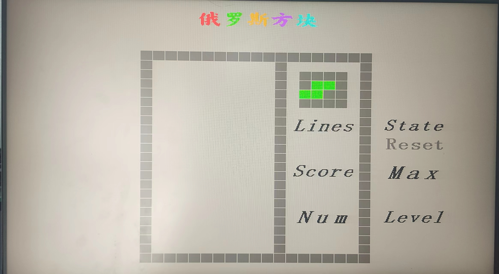
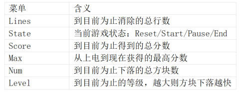
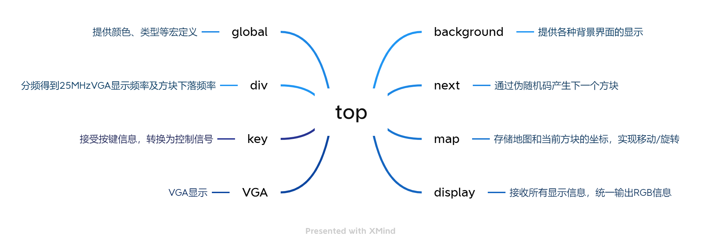

# Game-of-Tetris
FPGA implementation of Tetris Game 
## 总体介绍

​		本次创新实验主要受到学堂在线上[往届实验结果展示](https://www.xuetangx.com/learn/thu08071002402/thu08071002402/10327120/video/17445131?channel=i.area.learn_title)中FPGA和PSoC游戏系统的启发，单人做了一个俄罗斯方块小游戏。该游戏基本完全复现了经典俄罗斯方块游戏的玩法，由FPGA的八个按键来进行控制，分别是左移、右移、下落、旋转、复位、开始、暂停、继续。显示器的初始界面如下图所示：

​		其中八个菜单的含义如下：

## 设计思路

### 总体思路

​		本实验基本由Verilog编程得到，其涉及到的所有Verilog文件及其基本功能如下图所示：

